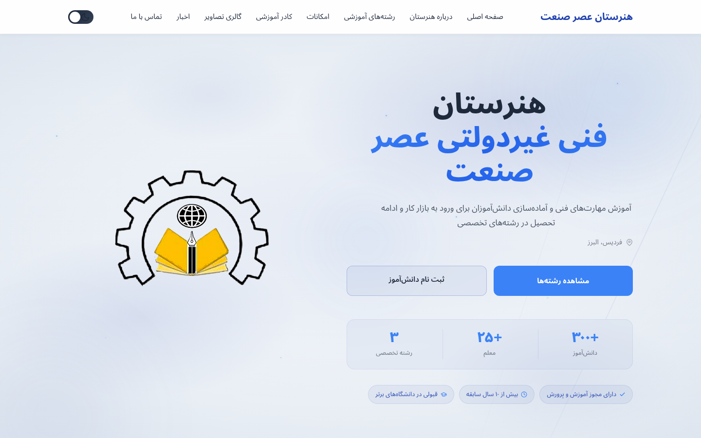
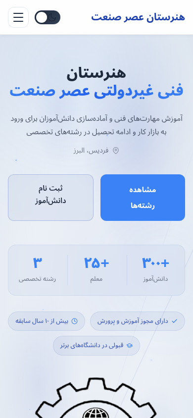

# وب‌سایت هنرستان فنی عصر صنعت

<div align="center">

### وب‌سایت مدرن و واکنش‌گرا برای هنرستان فنی عصر صنعت

یک وب‌سایت سبک و دوزبانه، ساخته‌شده با **HTML، CSS و JavaScript خالص** — بدون فریم‌ورک و بدون نیاز به ابزار Build.

[](https://developer.mozilla.org/en-US/docs/Web/HTML)
[](https://developer.mozilla.org/en-US/docs/Web/CSS)
[](https://developer.mozilla.org/en-US/docs/Web/JavaScript)
[](#پشتیبانی-از-rtl-و-زبان-فارسی)
[](#طراحی-واکنشگرا)
[](#فناوریهای-استفادهشده)
[](#مجوز)

[فارسی](README.fa.md) · [English](README.md)

</div>

## معرفی

این مخزن شامل پروژهٔ وب‌سایت رسمی **هنرستان فنی عصر صنعت** در **فردیس، استان البرز، ایران** است.

این وب‌سایت با هدف فراهم‌کردن دسترسی سریع و ساده برای دانش‌آموزان، والدین و بازدیدکنندگان به اطلاعات هنرستان، رشته‌های آموزشی، کادر آموزشی، اخبار، امکانات و اطلاعات تماس طراحی شده است.

تمام پروژه بدون استفاده از فریم‌ورک‌های JavaScript یا سیستم‌های Build توسعه یافته و به همین دلیل نگهداری، توسعه و استقرار آن بسیار ساده است.

## نکات برجسته

- **بدون وابستگی به فریم‌ورک** — HTML، CSS و JavaScript خالص
- **بدون فرآیند Build** — مخزن را Clone کرده و سایت را مستقیماً اجرا کنید
- **طراحی واکنش‌گرا** — بهینه‌شده برای دسکتاپ، تبلت و موبایل
- **پشتیبانی بومی از RTL** — طراحی‌شده برای محتوای فارسی
- **حالت روشن و تاریک** — همراه با ذخیرهٔ تنظیم انتخاب‌شده توسط کاربر
- **ساختار دسترس‌پذیر** — HTML معنایی، پشتیبانی از صفحه‌کلید و ویژگی‌های ARIA
- **ساختار مناسب SEO** — شامل Metadata، Open Graph، Twitter Cards و JSON-LD
- **معماری سبک** — مناسب برای سرویس‌های Static Hosting
- **تایپوگرافی اختصاصی فارسی** — با استفاده از فونت Vazirmatn

## تصاویر

<div align="center">

|                                      دسکتاپ                                      |                                     موبایل                                     |
| :------------------------------------------------------------------------------: | :----------------------------------------------------------------------------: |
|  |  |

</div>

> **نکته:** تصاویر بالا در حال حاضر Placeholder هستند. در صورت اضافه‌شدن اسکرین‌شات‌های واقعی دسکتاپ و موبایل، مسیر آن‌ها را در این بخش جایگزین کنید.

## قابلیت‌ها

| قابلیت                | توضیحات                                                      |
| --------------------- | ------------------------------------------------------------ |
| **حالت تاریک / روشن** | ذخیرهٔ تنظیم Theme کاربر با استفاده از `localStorage`        |
| **پشتیبانی RTL**      | چیدمان راست‌به‌چپ بهینه‌شده برای محتوای فارسی                |
| **طراحی واکنش‌گرا**   | سازگار با موبایل، تبلت، لپ‌تاپ و نمایشگرهای دسکتاپ           |
| **Scroll Reveal**     | نمایش تدریجی عناصر با استفاده از `IntersectionObserver`      |
| **هدر چسبان**         | Navigation شیشه‌ای با افکت Blur پس‌زمینه                     |
| **Lightbox تصاویر**   | نمایش بزرگ تصاویر گالری همراه با کنترل توسط صفحه‌کلید        |
| **فهرست کادر آموزشی** | کارت‌های اعضای کادر قابل دسته‌بندی بر اساس بخش               |
| **فرم تماس**          | اعتبارسنجی سمت کاربر همراه با نمایش پیام وضعیت               |
| **FAQ Accordion**     | بخش باز و بسته‌شونده برای پرسش‌های متداول                    |
| **News Modal**        | نمایش جزئیات اخبار و اطلاعیه‌ها بدون خروج از صفحه            |
| **SEO Metadata**      | پشتیبانی از Open Graph، Twitter Cards و Structured Data      |
| **Scroll Progress**   | نمایش میزان پیشرفت کاربر در پیمایش صفحه                      |
| **Hero متحرک**        | انیمیشن‌های ظریف و جلوه‌های بصری در بخش Hero                 |
| **تایپوگرافی فارسی**  | استفاده از فایل‌های محلی فونت Vazirmatn برای نمایش یکدست متن |

## رشته‌های آموزشی

وب‌سایت در حال حاضر دارای صفحات اختصاصی برای رشته‌های اصلی هنرستان است.

| رشته                        | حوزه‌های آموزشی                                          |
| --------------------------- | -------------------------------------------------------- |
| **شبکه و نرم‌افزار رایانه** | برنامه‌نویسی، شبکه، توسعه وب، نرم‌افزار و فناوری اطلاعات |
| **حسابداری**                | اصول حسابداری، مدیریت مالی و نرم‌افزارهای حسابداری       |
| **برق و الکترونیک**         | مدارهای الکترونیکی، سیستم‌های برق و مهارت‌های فنی عملی   |

صفحات مربوط به رشته‌ها در پوشهٔ [`programs/`](programs/) قرار دارند.

## فناوری‌های استفاده‌شده

### HTML5

برای ساختار معنایی صفحات و بهبود دسترس‌پذیری استفاده شده است.

موارد اصلی شامل:

- بخش‌بندی معنایی صفحات
- ویژگی‌های ARIA
- دکمه‌ها و کنترل‌های دسترس‌پذیر
- Metadata مربوط به SEO و شبکه‌های اجتماعی
- Structured Data

### CSS3

رابط کاربری سایت به‌طور کامل با CSS مدرن پیاده‌سازی شده است.

فناوری‌ها و تکنیک‌های مورد استفاده:

- CSS Custom Properties
- CSS Grid
- Flexbox
- Responsive Media Queries
- `clamp()`
- `backdrop-filter`
- `color-mix()`
- Keyframe Animations
- چیدمان‌های سازگار با RTL

### JavaScript

تمام قابلیت‌های تعاملی سایت با JavaScript خالص پیاده‌سازی شده‌اند.

APIها و الگوهای اصلی مورد استفاده:

- `IntersectionObserver`
- `localStorage`
- Event Delegation
- DOM APIs
- مدیریت رویدادهای صفحه‌کلید
- اعتبارسنجی فرم

هیچ فریم‌ورک JavaScript برای اجرای پروژه نیاز نیست.

## ساختار پروژه

```text
.
├── index.html
├── style.css
├── script.js
├── honarestan-asr-sanaat.png
│
├── README.md
├── README.fa.md
├── CONTRIBUTING.md
│
├── programs/
│   ├── network.html
│   ├── accounting.html
│   └── electronics.html
│
└── assets/
    ├── fonts/
    │   └── vazirmatn/
    │       └── ...
    │
    └── images/
        ├── school.webp
        ├── gallery/
        │   └── ...
        └── staff/
            └── ...
```

### فایل‌های اصلی

| فایل                        | کاربرد                                                  |
| --------------------------- | ------------------------------------------------------- |
| `index.html`                | صفحهٔ اصلی و Landing Page سایت                          |
| `style.css`                 | استایل‌های عمومی، Themeها، انیمیشن‌ها و طراحی واکنش‌گرا |
| `script.js`                 | قابلیت‌های تعاملی و رفتار رابط کاربری                   |
| `honarestan-asr-sanaat.png` | لوگوی هنرستان                                           |
| `README.md`                 | مستندات انگلیسی پروژه                                   |
| `README.fa.md`              | مستندات فارسی پروژه                                     |
| `programs/`                 | صفحات اختصاصی رشته‌های آموزشی                           |
| `assets/fonts/`             | فایل‌های فونت محلی                                      |
| `assets/images/`            | تصاویر سایت، گالری و تصاویر کادر آموزشی                 |

## شروع کار

از آن‌جایی که این پروژه یک وب‌سایت Static است، **نیازی به نصب وابستگی یا اجرای Build وجود ندارد**.

### ۱. Clone کردن مخزن

```bash
git clone <repository-url>
cd <repository-directory>
```

### ۲. اجرای وب‌سایت

می‌توانید فایل `index.html` را مستقیماً در یک مرورگر مدرن باز کنید.

با این حال، برای تجربهٔ بهتر هنگام توسعه پیشنهاد می‌شود سایت را از طریق یک HTTP Server محلی اجرا کنید.

### Python

```bash
python -m http.server 8000
```

### Node.js

```bash
npx serve .
```

### PHP

```bash
php -S localhost:8000
```

سپس آدرس زیر را در مرورگر باز کنید:

```text
http://localhost:8000
```

### Visual Studio Code

اگر از Visual Studio Code استفاده می‌کنید:

1. افزونهٔ **Live Server** را نصب کنید.
2. پوشهٔ پروژه را باز کنید.
3. روی فایل `index.html` راست‌کلیک کنید.
4. گزینهٔ **Open with Live Server** را انتخاب کنید.

## طراحی واکنش‌گرا

طراحی سایت بر اساس رویکرد Mobile-First انجام شده و برای نمایش صحیح در ابعاد مختلف صفحه بهینه شده است، از جمله:

- گوشی‌های هوشمند
- تبلت‌ها
- لپ‌تاپ‌ها
- نمایشگرهای دسکتاپ

چیدمان، Navigation، اندازهٔ متن، فاصله‌گذاری و اجزای تعاملی بر اساس اندازهٔ Viewport به‌صورت خودکار تنظیم می‌شوند.

## پشتیبانی از RTL و زبان فارسی

زبان فارسی در این پروژه به‌صورت یک قابلیت اصلی در نظر گرفته شده است.

رابط کاربری شامل موارد زیر است:

- چیدمان راست‌به‌چپ
- فاصله‌گذاری و Alignment سازگار با RTL
- تایپوگرافی مناسب زبان فارسی
- فایل‌های محلی فونت Vazirmatn
- نمایش واکنش‌گرای متن فارسی
- مستندات جداگانهٔ فارسی

نسخهٔ فارسی README از مسیر زیر در دسترس است:

**[README.fa.md](README.fa.md)**

## دسترس‌پذیری

این پروژه تلاش می‌کند تجربه‌ای مناسب و دسترس‌پذیر برای کاربران فراهم کند.

موارد پیاده‌سازی‌شده شامل:

- عناصر معنایی HTML
- استفاده از ARIA Labels در بخش‌های موردنیاز
- کنترل‌های قابل استفاده با صفحه‌کلید
- متن جایگزین مناسب برای تصاویر
- Focus Stateهای مشخص
- Navigation قابل دسترس
- استفادهٔ صحیح از عناصر Button
- وضعیت‌های `aria-expanded` برای بخش‌های باز و بسته‌شونده

## SEO

این وب‌سایت زیرساخت‌های متداول موردنیاز برای SEO و اشتراک‌گذاری در شبکه‌های اجتماعی را در اختیار دارد.

موارد اصلی شامل:

- عنوان و توضیحات صفحات
- Open Graph Metadata
- Twitter Card Metadata
- Structured Data با JSON-LD
- ساختار معنایی Headingها
- متن جایگزین مناسب برای تصاویر
- ساختار HTML مناسب موتورهای جست‌وجو

پیش از انتشار نهایی سایت، موارد زیر را با اطلاعات واقعی پروژه جایگزین کنید:

- نام دامنه
- Canonical URL
- تصویر Social Preview
- اطلاعات تماس
- اطلاعات رسمی هنرستان

## پشتیبانی مرورگر

این وب‌سایت برای نسخه‌های مدرن مرورگرهای اصلی طراحی شده است.

| مرورگر              | پشتیبانی |
| ------------------- | :------: |
| Google Chrome       |    ✅    |
| Microsoft Edge      |    ✅    |
| Mozilla Firefox     |    ✅    |
| Safari              |    ✅    |
| Chrome برای Android |    ✅    |
| Safari در iOS       |    ✅    |

برخی جلوه‌های بصری به پشتیبانی مرورگر از قابلیت‌های زیر وابسته هستند:

- CSS Custom Properties
- CSS Grid
- `backdrop-filter`
- `color-mix()`
- `IntersectionObserver`

حتی در مرورگرهایی که برخی از این جلوه‌های غیرضروری را پشتیبانی نمی‌کنند، قابلیت‌های اصلی وب‌سایت باید قابل استفاده باقی بمانند.

## استقرار

از آن‌جایی که پروژه کاملاً از فایل‌های Static تشکیل شده است، می‌توان آن را تقریباً روی هر سرویس Static Hosting مستقر کرد.

### GitHub Pages

1. پروژه را روی GitHub Push کنید.
2. وارد بخش **Settings** مخزن شوید.
3. بخش **Pages** را باز کنید.
4. Branch مناسب را انتخاب کنید.
5. تنظیمات را ذخیره کنید.

### Netlify

برای استقرار می‌توانید:

- مخزن GitHub را به Netlify متصل کنید، یا
- پوشهٔ پروژه را مستقیماً Upload کنید.

نیازی به Build Command وجود ندارد.

### Vercel

مخزن GitHub را Import کرده و پروژه را به‌عنوان یک وب‌سایت Static Deploy کنید.

### هاست سنتی

فایل‌های پروژه را می‌توانید از طریق روش‌های زیر روی سرور آپلود کنید:

- FTP
- SFTP
- SSH
- کنترل‌پنل هاست

هیچ Runtime سمت سروری برای اجرای این پروژه موردنیاز نیست.

## توسعه

هنگام توسعه یا اعمال تغییرات در پروژه، بهتر است معماری فعلی پروژه تا حد امکان سبک باقی بماند.

اصول پیشنهادی:

- از اضافه‌کردن وابستگی‌های غیرضروری خودداری کنید
- JavaScript را خوانا و قابل نگهداری نگه دارید
- سازگاری RTL را حفظ کنید
- هر دو حالت روشن و تاریک را تست کنید
- طراحی موبایل و دسکتاپ را بررسی کنید
- دسترس‌پذیری با صفحه‌کلید را حفظ کنید
- تصاویر را قبل از اضافه‌کردن بهینه کنید
- ساختار معنایی HTML را حفظ کنید
- از Layout Shiftهای غیرضروری جلوگیری کنید

## عملکرد

این پروژه عمداً سبک طراحی شده و از فریم‌ورک‌های سنگین سمت کاربر استفاده نمی‌کند.

برای بهبود بیشتر عملکرد در محیط Production می‌توان اقدامات زیر را انجام داد:

- فشرده‌سازی تصاویر با WebP یا AVIF
- Lazy Load کردن تصاویر غیرضروری
- Minify کردن CSS و JavaScript
- فعال‌سازی HTTP Compression
- تنظیم Browser Cache
- ارائهٔ فایل‌ها از طریق CDN
- Preload کردن هوشمندانهٔ فونت‌های محلی ضروری

## مشارکت

مشارکت، پیشنهاد برای بهبود و گزارش باگ‌ها پذیرفته می‌شود.

پیش از مشارکت لطفاً فایل زیر را مطالعه کنید:

**[CONTRIBUTING.md](CONTRIBUTING.md)**

برای ارسال تغییرات:

1. مخزن را Fork کنید.
2. یک Branch جدید ایجاد کنید.
3. تغییرات موردنظر را اعمال کنید.
4. سایت را در حالت دسکتاپ و موبایل آزمایش کنید.
5. یک Pull Request با توضیحات واضح ارسال کنید.

## تماس

## درباره هنرستان

**هنرستان پسرانه عصر صنعت** یک هنرستان فنی‌وحرفه‌ای غیردولتی در فردیس، استان البرز است که در رشته‌های فنی و تخصصی فعالیت می‌کند.

### رشته‌های آموزشی

- شبکه و نرم‌افزار رایانه
- حسابداری
- الکتروتکنیک

## اطلاعات تماس

| اطلاعات    | جزئیات                               |
| ---------- | ------------------------------------ |
| **نام**    | هنرستان پسرانه عصر صنعت              |
| **نوع**    | هنرستان فنی‌وحرفه‌ای غیردولتی پسرانه |
| **موقعیت** | فردیس، استان البرز، ایران            |
| **تلفن**   | 026-36508764                         |

> پیش از انتشار نهایی وب‌سایت، اطلاعات تماس Placeholder را با اطلاعات رسمی و تأییدشدهٔ هنرستان جایگزین کنید.

## مجوز

**تمامی حقوق محفوظ است.**

حق نشر © هنرستان فنی عصر صنعت.

کد منبع، طراحی، محتوای وب‌سایت، هویت بصری و فایل‌های مرتبط بدون دریافت اجازه از صاحب اثر نباید کپی، بازنشر، تغییر یا مورد استفاده قرار گیرند.

<div align="center">

**هنرستان فنی عصر صنعت**

ساخته‌شده با HTML، CSS و JavaScript.

</div>
