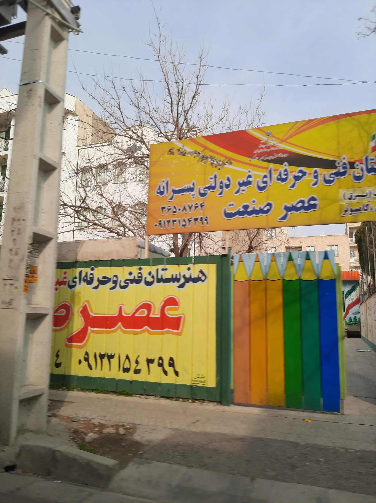

# ASR Sanar School Website

<div align="center">

**A modern, fully-responsive website for Asr Sanat Technical School**  
Built with zero dependencies — pure HTML, CSS & JavaScript

[](https://developer.mozilla.org/en-US/docs/Web/HTML)
[](https://developer.mozilla.org/en-US/docs/Web/CSS)
[](https://developer.mozilla.org/en-US/docs/Web/JavaScript)
[](#)
[](#)

[English](#) | [فارسی](README.fa.md)

</div>

---

## Why This Project?

Asr Sanat Technical School (هنرستان عصر صنعت) needed a website that reflects its identity — a forward-thinking vocational school for boys in Fardis, Alborz, Iran. This project delivers a production-ready, bilingual (Persian/English) web experience with:

- **Zero build tools** — no npm, no webpack, no frameworks. Just open `index.html`.
- **Full RTL support** — native right-to-left layout with the Vazirmatn Persian font.
- **Mobile-first design** — works flawlessly on phones, tablets, and desktops.
- **Accessible** — ARIA labels, keyboard navigation, semantic HTML.
- **SEO-ready** — Open Graph, Twitter Cards, and JSON-LD structured data included.

---

## Screenshots

<div align="center">

| Desktop | Mobile |
|---------|--------|
|  |  |

</div>

> Replace the above with actual screenshots if available.

---

## Features at a Glance

| Feature | Description |
|---------|-------------|
| Dark / Light Mode | Persistent toggle saved to `localStorage` |
| RTL Layout | Native Persian typography with Vazirmatn font |
| Responsive Design | Mobile-first, all screen sizes |
| Scroll Reveal | IntersectionObserver-powered animations |
| Glassmorphism Header | Sticky header with backdrop blur |
| Image Lightbox | Click-to-zoom gallery with keyboard navigation |
| Staff Directory | Filterable cards by department |
| Contact Form | With validation and toast notifications |
| FAQ Accordion | Collapsible frequently asked questions |
| News Modal | Expandable news and announcements |
| SEO Optimized | Open Graph, Twitter Card, JSON-LD |
| Scroll Progress Bar | Visual page scroll indicator |
| Animated Hero | Gradient animation with floating image effect |

---

## Programs

| Program | Focus Areas |
|---------|-------------|
| **Network & Software** | Programming, computer networking, web development, IT skills |
| **Accounting** | Accounting principles, financial management, accounting software |
| **Electronics & Electrical** | Electronic circuits, industrial electrical systems, technical skills |

---

## Tech Stack

| Layer | Details |
|-------|---------|
| **HTML5** | Semantic markup, ARIA attributes (`aria-label`, `aria-expanded`, `role`) |
| **CSS3** | Custom properties, CSS Grid, `backdrop-filter`, `color-mix()`, `clamp()`, keyframe animations |
| **JavaScript** | ES6+ vanilla JS — `IntersectionObserver`, event delegation, `localStorage` |

---

## Project Structure

```
.
├── index.html                  # Main landing page
├── style.css                   # All styles (CSS custom properties, responsive)
├── script.js                   # All interactivity (dark mode, lightbox, etc.)
├── honarestan-asr-sanaat.png   # School logo
├── README.md                   # English documentation
├── README.fa.md                # فارسی مستندات
├── programs/
│   ├── network.html            # Network & Software program page
│   ├── accounting.html         # Accounting program page
│   └── electronics.html        # Electronics program page
└── assets/
    ├── fonts/
    │   └── vazirmatn/          # Vazirmatn Persian font (11 weights)
    └── images/
        ├── school.webp         # Hero school photo
        ├── gallery/            # Gallery images
        └── staff/              # Staff photos
```

---

## Getting Started

This is a static website. No build step required.

### Option 1: Direct Open

Simply open `index.html` in any modern browser.

### Option 2: Local Server

```bash
# Python
python -m http.server 8000

# Node.js
npx serve .

# PHP
php -S localhost:8000
```

Then visit `http://localhost:8000`.

### Option 3: VS Code Live Server

Install the **Live Server** extension, right-click `index.html`, and choose **Open with Live Server**.

---

## Browser Support

| Browser | Supported |
|---------|-----------|
| Chrome 80+ | Yes |
| Firefox 78+ | Yes |
| Safari 14+ | Yes |
| Edge 80+ | Yes |
| Mobile Safari | Yes |
| Chrome Android | Yes |

Requires support for: CSS Custom Properties, CSS Grid, `backdrop-filter`, IntersectionObserver API.

---

## Deployment

This site can be deployed anywhere that serves static files:

- **GitHub Pages** — push to `main`, enable Pages in repo settings
- **Netlify** — drag-and-drop or connect to repo
- **Vercel** — import project, zero-config deploy
- **Any web server** — upload files via FTP/SFTP

---

## Contributing

Contributions are welcome. Please see [CONTRIBUTING.md](CONTRIBUTING.md) for guidelines.

---

## Contact

**Asr Sanat Technical School** (هنرستان عصر صنعت)

| | |
|---|---|
| Address | Fardis, Alborz, Iran (between Canal and Fleke-3, 29th New Street) |
| Phone | 026-000000 |
| Email | info@school.ir |
| Hours | Saturday to Wednesday, 8:00 - 16:00 |

---

## License

All rights reserved. &copy; Asr Sanat Technical School
