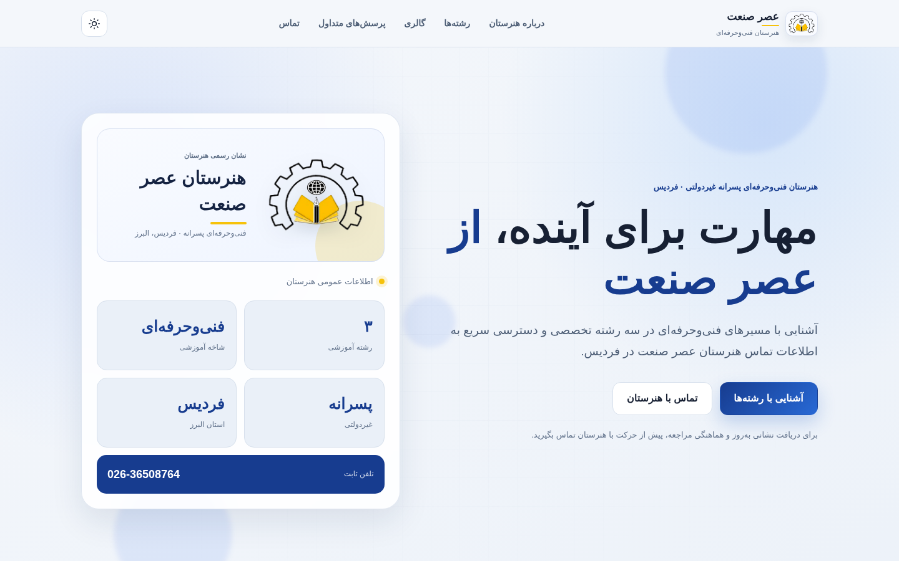
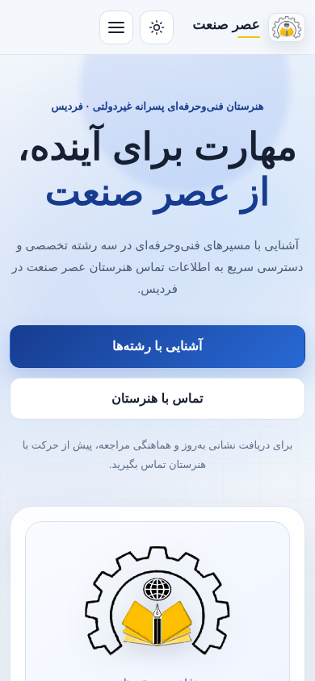

# Asr Sanat Technical School Website

<!-- repo-badges:start -->
<p align="center">
  <a href="https://hits.sh/github.com/power0matin/asr-sanar-school-website/"></a>
  <a href="https://github.com/power0matin/asr-sanar-school-website/stargazers"></a>
  <a href="https://github.com/power0matin/asr-sanar-school-website/forks"></a>
  <a href="https://github.com/power0matin/asr-sanar-school-website/issues"></a>
  <a href="LICENSE"></a>
</p>
<!-- repo-badges:end -->

<div align="center">


### A lightweight, Persian-first website for Asr Sanat Technical School in Fardis

**Zero runtime dependencies · Responsive · RTL · Accessible · Dark mode · Static hosting**

[](https://developer.mozilla.org/en-US/docs/Web/HTML)
[](https://developer.mozilla.org/en-US/docs/Web/CSS)
[](https://developer.mozilla.org/en-US/docs/Web/JavaScript)
[](#accessibility--rtl)
[](#tech-stack)
[](LICENSE)

[Live Demo](https://power0matin.github.io/asr-sanar-school-website/) · [فارسی](README.fa.md)

</div>

## Overview

This repository contains a static website project for **Asr Sanat Boys Technical School** (هنرستان پسرانه عصر صنعت) in **Fardis, Alborz Province, Iran**. The public-facing site is Persian-first; the repository documentation is available in both English and Persian.

The revised website intentionally avoids unverified claims. Public directory information consistently identifies the school as a private boys' vocational/technical school in Fardis and lists three programs: **Computer Network & Software, Accounting, and Electrotechnics**. A fixed phone number is also publicly listed as `026-36508764`. Street-address listings conflict, so the site asks visitors to confirm the current address by phone before traveling. See [SOURCES.md](SOURCES.md).

## Official Branding

The website uses the school logo supplied for this project. The untouched upload is kept as `assets/images/school-logo-original.png`, while `school-logo.png` only removes extra transparent canvas for cleaner placement in the UI. Favicons, app icons, and the social preview are derived from the same logo.

## Screenshots

| Desktop | Mobile |
| :---: | :---: |
|  |  |

Dark-mode captures are also generated as `desktop-dark.png` and `mobile-dark.png`.

## Features

- Persian RTL layout with the local Vazirmatn font
- **Asr Sanat school logo** used consistently in the header, hero, footer, program pages, 404 page, favicon, app icons, and social preview
- Responsive desktop, tablet, and mobile layouts
- Persistent light/dark theme with system-theme fallback
- Accessible mobile navigation and keyboard focus states
- FAQ accordion with synchronized ARIA state
- Clean responsive gallery with a desktop mosaic, mobile swipe rail, keyboard access, and lightbox
- Dedicated pages for all three listed educational programs
- Canonical URLs, Open Graph, Twitter Card metadata, JSON-LD, `robots.txt`, and `sitemap.xml`
- No fake contact-form success state; contact uses the publicly listed fixed phone number
- Portable screenshot tooling and browser smoke tests
- GitHub Actions validation on pushes and pull requests

## School Information

| Information | Details |
| --- | --- |
| **Name** | Asr Sanat Boys Technical School |
| **Type** | Private boys' vocational & technical school |
| **Location** | Fardis, Alborz Province, Iran |
| **Phone** | +98 26 3650 8764 |
| **Programs** | Computer Network & Software, Accounting, Electrotechnics |

The website does **not** publish an email address, opening hours, student/teacher counts, success statistics, or a precise street address unless they can be verified. Public-data provenance and discrepancies are documented in [SOURCES.md](SOURCES.md).

## Tech Stack

The production website has **zero runtime package dependencies**:

- **HTML5** — semantic structure, metadata, ARIA
- **CSS3** — Grid/Flexbox, custom properties, responsive design and lightweight motion
- **Vanilla JavaScript** — theme persistence, menu state, FAQ, gallery, lightbox, scroll progress

Playwright is included only as a **development dependency** for automated browser tests and screenshots.

## Project Structure

```text
.
├── index.html
├── style.css
├── script.js
├── 404.html
├── robots.txt
├── sitemap.xml
├── site.webmanifest
├── screenshot.js
├── package.json
├── package-lock.json
├── README.md
├── README.fa.md
├── SOURCES.md
├── CONTRIBUTING.md
├── LICENSE
├── DELETE_FILES.txt
├── programs/
│   ├── network.html
│   ├── accounting.html
│   └── electronics.html
├── scripts/
│   └── validate.js
├── tests/
│   └── smoke.js
├── docs/
│   └── screenshots/
├── assets/
│   ├── data/
│   │   └── school.json
│   ├── fonts/
│   │   └── vazirmatn/
│   └── images/
│       ├── school-logo.png
│       ├── school-logo-original.png
│       ├── favicon.ico
│       ├── apple-touch-icon.png
│       ├── icon-192.png
│       ├── icon-512.png
│       └── og-cover.png
└── .github/
    └── workflows/
        └── ci.yml
```

## Getting Started

No build step is required for the website itself.

```bash
git clone https://github.com/power0matin/asr-sanar-school-website.git
cd asr-sanar-school-website
python -m http.server 8000
```

Then open `http://localhost:8000`.

### Development tooling

Install the optional development dependencies when you want to run validation, browser tests, or screenshot generation:

```bash
npm ci
npx playwright install chromium
npm run validate
npm test
```

To capture the four standard screenshots while a local server is running on port `4173`:

```bash
npm run screenshots
```

For another URL:

```bash
BASE_URL=https://example.com npm run screenshots
```

## Educational Program Pages

- [`programs/network.html`](programs/network.html) — Computer Network & Software
- [`programs/accounting.html`](programs/accounting.html) — Accounting
- [`programs/electronics.html`](programs/electronics.html) — Electrotechnics

The descriptions are intentionally general and direct visitors to the school for current admissions, capacity, and curriculum details.

## Accessibility & RTL

The site includes:

- `lang="fa"` and `dir="rtl"`
- Skip-to-content navigation
- Visible `:focus-visible` states
- Mobile menu `aria-expanded` synchronization
- FAQ `aria-expanded` synchronization
- Keyboard-operable gallery and lightbox
- Lightbox focus restoration and focus containment
- Text colors selected to meet normal-text WCAG AA contrast on primary surfaces

## SEO & Deployment

The current canonical deployment is GitHub Pages:

`https://power0matin.github.io/asr-sanar-school-website/`

If the project moves to an official custom domain, update canonical URLs, Open Graph URLs, sitemap entries, manifest `start_url`, and structured data together.

The site can also be deployed to Netlify, Vercel, Cloudflare Pages, or any conventional static web server.

## Testing

`npm run validate` checks local references, duplicate IDs, required metadata, placeholder regressions, accessibility hooks, and school-data synchronization.

`npm test` starts a local static server and checks the site in Chromium, including:

- desktop and mobile horizontal overflow
- theme switching and persistence
- FAQ behavior and ARIA state
- lightbox open/close and body scroll restoration
- mobile navigation state
- all three program pages
- uncaught JavaScript errors

CI runs both checks on pushes to `main` and on pull requests.

## Updating School Information

Start with [`assets/data/school.json`](assets/data/school.json), then update public-facing text and metadata. Do not add statistics, addresses, emails, staff names, testimonials, or admission claims without a trustworthy current source or direct confirmation from the school.

## Contributing

Bug reports and focused improvements are welcome. See [CONTRIBUTING.md](CONTRIBUTING.md).

## License

**All Rights Reserved.** See [LICENSE](LICENSE). Public repository access does not grant permission to reuse the school's branding, site design, content, or assets.
